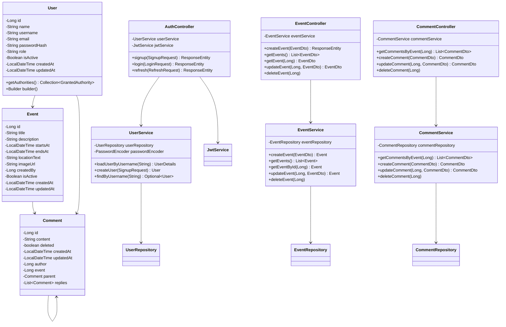
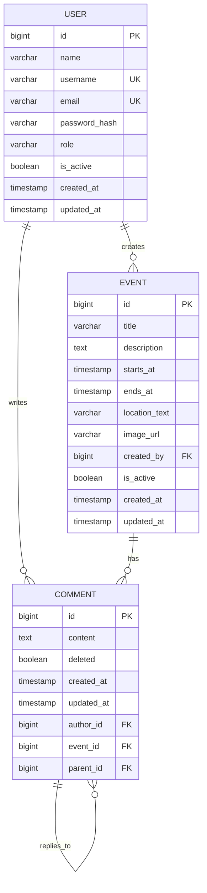
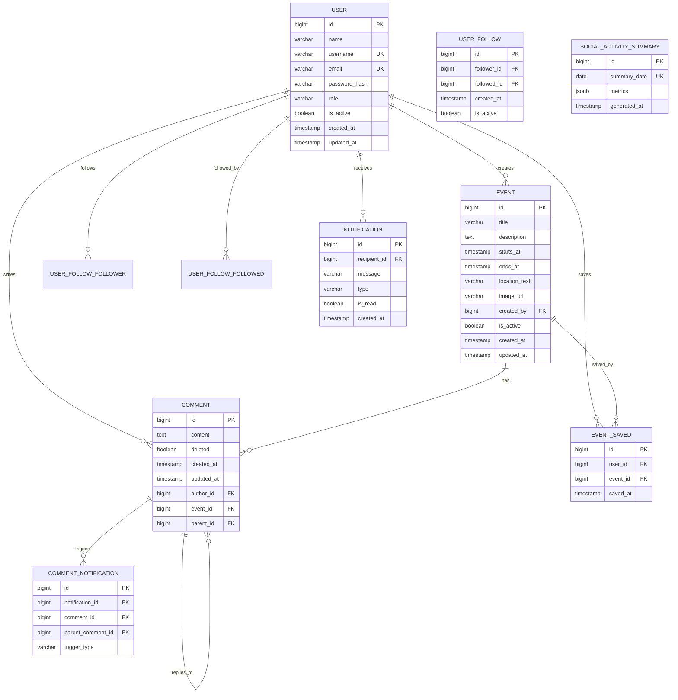
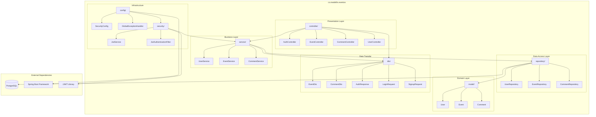
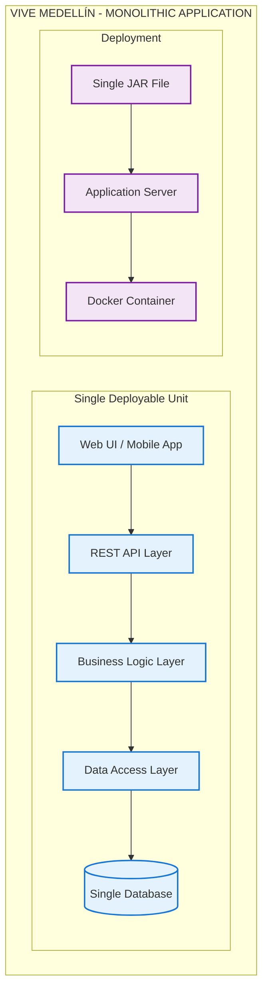

# Vive Medellín API (Spring Boot + PostgreSQL + JWT)

Backend en Spring Boot 3 (Java 17) con autenticación JWT, PostgreSQL y JPA/Hibernate. Actualmente Flyway está deshabilitado y el esquema se gestiona con Hibernate (create-drop).

## Stack
- Java 17+, Spring Boot 3, Maven
- Spring Web, Spring Data JPA, Spring Security, Validation
- PostgreSQL
- JJWT (HS256)
- Lombok (requiere annotation processing en el IDE)
- Actuator (health)

## Requisitos
- Java (JDK) 17+
- Maven 3.9+
- Docker (para DB local) o una instancia de PostgreSQL

## Arranque rápido
1) Base de datos con Docker Compose:
```zsh
cd /Users/yiyi/viveMedellin/api
# Si ves un warning por 'version:' es inocuo en Compose v2
docker compose up -d
docker compose ps
```

2) Ejecutar la app (Maven):
```zsh
cd /Users/yiyi/viveMedellin/api
export DB_URL=jdbc:postgresql://localhost:5432/eventos
export DB_USER=eventos
export DB_PASS=eventos
# Recomendado: definir una clave JWT robusta
export JWT_SECRET=$(python3 - <<'PY'
import secrets; print(secrets.token_urlsafe(64))
PY
)

mvn -DskipTests spring-boot:run
```

3) Verificar salud:
```zsh
curl -fsS http://localhost:8080/actuator/health
# {"status":"UP"}
```

## Configuración (application.yml)
- JPA/Hibernate: `ddl-auto: create-drop` (crea y elimina el esquema al iniciar/detener la app)
- Flyway: `enabled: false`
- Dialect: `org.hibernate.dialect.PostgreSQLDialect`
- Variables de entorno soportadas:
  - DB_URL (por defecto `jdbc:postgresql://localhost:5432/eventos`)
  - DB_USER (por defecto `eventos`)
  - DB_PASS (por defecto `eventos`)
  - JWT_SECRET (por defecto `changeme`; cambiar fuera de local)
  - CORS_ALLOWED_ORIGINS (por defecto `http://localhost:5173`)

## Ejecutar con JAR
```zsh
cd /Users/yiyi/viveMedellin/api
mvn -DskipTests clean package
java -jar target/eventos-0.0.1-SNAPSHOT.jar
```
Cambiar puerto:
```zsh
mvn -DskipTests spring-boot:run -Dspring-boot.run.arguments=--server.port=8081
```

## Endpoints
- Health (libre):
  - `GET /actuator/health` → `{ "status": "UP" }`

- Auth (libres):
  - `POST /api/auth/signup` → 200 sin cuerpo (crea usuario)
    - Body: `{ "name", "username", "email", "password" }`
  - `POST /api/auth/login` → 200 `{ accessToken, refreshToken, user }`
    - Body: `{ "username", "password" }`
  - `POST /api/auth/refresh` → 200 con nuevo `accessToken`
    - Body: `{ "refreshToken" }`
  - `GET /api/auth/allUsers` → lista de usuarios

- Events (ACTUALMENTE públicos según SecurityConfig):
  - `GET /api/events?page=0&size=10` → lista de `EventSummaryDto`
  - `GET /api/events/{id}` → `EventDto`
  - `POST /api/events/save` → crea evento a partir de `EventDto`
  - `PUT /api/events/update` → actualiza y devuelve `EventDto`
  - `DELETE /api/events/{id}` → 204 sin contenido
  - `GET /api/events/user/{userId}` → lista de `EventDto` del usuario

> Nota: si se desea proteger los endpoints de eventos, actualizar `SecurityConfig` para exigir autenticación (quitar `permitAll()` en `/api/events/**`).

## Ejemplos (curl)
Signup (200 sin cuerpo):
```zsh
curl -i -X POST http://localhost:8080/api/auth/signup \
  -H 'Content-Type: application/json' \
  -d '{"name":"Demo","username":"demo","email":"demo@local","password":"Demo123!"}'
```

Login y usar token:
```zsh
TOKEN=$(curl -s -X POST http://localhost:8080/api/auth/login \
  -H 'Content-Type: application/json' \
  -d '{"username":"demo","password":"Demo123!"}' | \
  python3 -c 'import sys, json; print(json.load(sys.stdin)["accessToken"])')

# Si proteges eventos en el futuro:
curl -s http://localhost:8080/api/events -H "Authorization: Bearer $TOKEN"
```

## Troubleshooting
- Puerto 8080 en uso:
```zsh
lsof -ti tcp:8080 | xargs kill -9
```
- Docker Compose: ejecuta desde `api/` o usa `-f /ruta/al/docker-compose.yml`.
- DB inaccesible: revisa `docker compose ps`, credenciales y `DB_URL`.
- 403 en endpoints protegidos: falta `Authorization: Bearer <accessToken>` o token inválido.

## Arquitectura y Diseño

### Diagrama de Clases - Interacción Social y Comunitaria

La aplicación está diseñada para evolucionar hacia un sistema de interacción social completo. El siguiente diagrama muestra tanto el estado actual como las extensiones planificadas:

#### Estado Actual del Sistema



#### Funcionalidades de Interacción Social Planificadas

**🎯 Feature 3: Interacción Social y Comunitaria**

Las siguientes funcionalidades están planificadas para implementación:

1. **✅ Autenticación y Autorización** - *(Implementado)*
   - JWT con Spring Security
   - Sistema de roles básico

2. **✅ Crear y Consultar Comentarios** - *(Implementado)*
   - Comentarios en eventos
   - Estructura jerárquica (respuestas)

3. **🚀 Extensiones Planificadas:**
   - **Sistema de Seguimiento**: Seguir usuarios con intereses similares
   - **Moderación Avanzada**: Eliminar comentarios (propios/admin)
   - **Notificaciones**: Nuevos comentarios en eventos guardados
   - **Dashboard Social**: Eventos más comentados y usuarios activos
   - **Compartir Eventos**: Funcionalidad social de compartir

#### Arquitectura Extendida (Planificada)

```mermaid
classDiagram
    %% === NUEVAS ENTIDADES PARA INTERACCIÓN SOCIAL ===
    class UserFollow {
        -Long id
        -User follower
        -User followed
        -LocalDateTime createdAt
        -boolean isActive
    }

    class EventSaved {
        -Long id
        -User user
        -Event event
        -LocalDateTime savedAt
    }

    class Notification {
        <<abstract>>
        -Long id
        -User recipient
        -String message
        -NotificationType type
        -boolean isRead
        -LocalDateTime createdAt
        +markAsRead()
    }

    class CommentNotification {
        -Comment comment
        -Comment parentComment
        -NotificationTrigger trigger
    }

    class SocialActivitySummary {
        -Long id
        -LocalDate date
        -List~Event~ mostCommentedEvents
        -List~User~ mostActiveUsers
        -Map~String, Integer~ activityMetrics
    }

    %% === INTERFACES (PRINCIPIOS SOLID) ===
    class INotificationService {
        <<interface>>
        +sendNotification(Notification)
        +getUnreadNotifications(User) List~Notification~
    }

    class IUserInteractionService {
        <<interface>>
        +followUser(User, User) UserFollow
        +saveEvent(User, Event) EventSaved
        +getFollowers(User) List~User~
    }

    class ISocialActivityService {
        <<interface>>
        +generateDailyActivitySummary() SocialActivitySummary
        +getMostCommentedEvents(int) List~Event~
        +getMostActiveUsers(int) List~User~
    }

    %% === SERVICIOS EXTENDIDOS ===
    class NotificationService {
        +createCommentNotification(Comment, User)
        +sendNotificationToEventSavers(Event, Comment)
        +getUnreadNotifications(User) List~Notification~
    }

    class UserInteractionService {
        +followUser(User, User) UserFollow
        +saveEvent(User, Event) EventSaved
        +isFollowing(User, User) boolean
    }

    class SocialActivityService {
        +generateDailyActivitySummary() SocialActivitySummary
        +getMostActiveUsersInPeriod(LocalDate, LocalDate) List~User~
    }

    %% === NUEVO CONTROLADOR ===
    class SocialController {
        +followUser(Long) ResponseEntity
        +saveEvent(Long) ResponseEntity
        +getNotifications() List~NotificationDto~
        +getSocialActivityDashboard() SocialActivitySummaryDto
    }

    %% Relaciones planificadas (simplificadas para compatibilidad Mermaid)
    User --> UserFollow
    User --> UserFollow
    User --> EventSaved
    Event --> EventSaved
    User --> Notification
    Comment --> CommentNotification
```



#### Consideraciones de Seguridad y Accesibilidad

- **🔐 Seguridad**: Autorización granular, validación de entrada, auditoría
- **♿ Accesibilidad**: DTOs con metadatos UI, estructura semántica
- **📊 Monitoreo**: Métricas de actividad y dashboards administrativos

---

## Modelado de Datos

### 📋 Entidades y Reglas de Negocio

#### **Entidades Actuales** ✅

##### **1. User (Usuario)**
**Reglas de Negocio:**
- Un usuario debe tener un nombre de usuario único en el sistema
- El email debe ser único y válido
- La contraseña debe almacenarse hasheada (BCrypt)
- Los usuarios pueden tener roles: USER, ADMIN, MODERATOR
- Un usuario puede estar activo o inactivo
- Todos los usuarios deben tener timestamps de creación y actualización
- Un usuario puede crear múltiples eventos
- Un usuario puede escribir múltiples comentarios

##### **2. Event (Evento)**
**Reglas de Negocio:**
- Todo evento debe tener un título y descripción
- Un evento debe tener fecha/hora de inicio y fin
- La fecha de inicio debe ser anterior a la fecha de fin
- Un evento debe tener una ubicación en formato texto
- Un evento puede tener una imagen (URL)
- Todo evento es creado por un usuario específico
- Los eventos pueden estar activos o inactivos (soft delete)
- Un evento puede tener múltiples comentarios

##### **3. Comment (Comentario)**
**Reglas de Negocio:**
- Todo comentario debe tener contenido (texto)
- Un comentario pertenece a un evento específico
- Un comentario es escrito por un usuario específico
- Los comentarios soportan respuestas (estructura jerárquica)
- Un comentario puede tener un comentario padre (reply)
- Los comentarios no se eliminan físicamente (soft delete: deleted=true)
- Todos los comentarios tienen timestamps de creación y actualización

#### **Entidades Planificadas** 🚀

##### **4. UserFollow (Seguimiento entre Usuarios)**
**Reglas de Negocio:**
- Un usuario (follower) puede seguir a otro usuario (followed)
- No puede haber seguimientos duplicados activos
- Un usuario no puede seguirse a sí mismo
- Los seguimientos pueden desactivarse (soft delete)
- Debe registrarse la fecha del seguimiento

##### **5. EventSaved (Eventos Guardados)**
**Reglas de Negocio:**
- Un usuario puede guardar eventos de su interés
- Un evento puede ser guardado por múltiples usuarios
- No puede haber duplicados de usuario-evento guardado
- Se debe registrar la fecha en que se guardó
- Los usuarios reciben notificaciones de nuevos comentarios en eventos guardados

##### **6. Notification (Notificación)**
**Reglas de Negocio:**
- Toda notificación tiene un destinatario (recipient)
- Las notificaciones pueden ser de diferentes tipos (comentario, respuesta, evento compartido, nuevo seguidor)
- Las notificaciones tienen estado: leída/no leída
- Las notificaciones especializadas (CommentNotification) heredan de la base
- Debe registrarse la fecha de creación

##### **7. CommentNotification (Notificación de Comentario)**
**Reglas de Negocio:**
- Se genera cuando alguien comenta en un evento guardado por el usuario
- Se genera cuando alguien responde a un comentario del usuario
- Referencia al comentario que generó la notificación
- Puede referenciar al comentario padre en caso de respuestas

##### **8. SocialActivitySummary (Resumen de Actividad Social)**
**Reglas de Negocio:**
- Genera estadísticas diarias de actividad en la plataforma
- Identifica eventos con más comentarios
- Identifica usuarios más activos
- Almacena métricas agregadas (total comentarios, usuarios activos, etc.)
- Se regenera periódicamente para dashboard administrativo

### 🔍 Principales Consultas del Sistema

#### **Consultas Actuales** ✅

1. **Autenticación y Usuarios**
   ```sql
   -- Buscar usuario por username para login
   SELECT * FROM users WHERE username = ?
   
   -- Buscar usuario por email
   SELECT * FROM users WHERE email = ?
   
   -- Listar todos los usuarios activos
   SELECT * FROM users WHERE is_active = true
   ```

2. **Gestión de Eventos**
   ```sql
   -- Obtener eventos paginados
   SELECT * FROM events WHERE is_active = true ORDER BY starts_at DESC LIMIT ? OFFSET ?
   
   -- Obtener evento por ID
   SELECT * FROM events WHERE id = ?
   
   -- Obtener eventos creados por un usuario
   SELECT * FROM events WHERE created_by = ? ORDER BY created_at DESC
   
   -- Buscar eventos por rango de fechas
   SELECT * FROM events WHERE starts_at BETWEEN ? AND ? AND is_active = true
   ```

3. **Sistema de Comentarios**
   ```sql
   -- Obtener comentarios de un evento (sin respuestas)
   SELECT * FROM comments WHERE event_id = ? AND parent_id IS NULL AND deleted = false
   
   -- Obtener respuestas de un comentario
   SELECT * FROM comments WHERE parent_id = ? AND deleted = false ORDER BY created_at ASC
   
   -- Contar comentarios de un evento
   SELECT COUNT(*) FROM comments WHERE event_id = ? AND deleted = false
   ```

#### **Consultas Planificadas** 🚀

4. **Seguimiento de Usuarios**
   ```sql
   -- Obtener usuarios que sigue un usuario
   SELECT u.* FROM users u
   JOIN user_follows uf ON u.id = uf.followed_id
   WHERE uf.follower_id = ? AND uf.is_active = true
   
   -- Obtener seguidores de un usuario
   SELECT u.* FROM users u
   JOIN user_follows uf ON u.id = uf.follower_id
   WHERE uf.followed_id = ? AND uf.is_active = true
   
   -- Verificar si un usuario sigue a otro
   SELECT EXISTS(SELECT 1 FROM user_follows 
                 WHERE follower_id = ? AND followed_id = ? AND is_active = true)
   ```

5. **Eventos Guardados**
   ```sql
   -- Obtener eventos guardados por un usuario
   SELECT e.* FROM events e
   JOIN events_saved es ON e.id = es.event_id
   WHERE es.user_id = ? ORDER BY es.saved_at DESC
   
   -- Obtener usuarios que guardaron un evento
   SELECT u.* FROM users u
   JOIN events_saved es ON u.id = es.user_id
   WHERE es.event_id = ?
   ```

6. **Sistema de Notificaciones**
   ```sql
   -- Obtener notificaciones no leídas de un usuario
   SELECT * FROM notifications 
   WHERE recipient_id = ? AND is_read = false 
   ORDER BY created_at DESC
   
   -- Contar notificaciones no leídas
   SELECT COUNT(*) FROM notifications 
   WHERE recipient_id = ? AND is_read = false
   
   -- Marcar notificaciones como leídas
   UPDATE notifications SET is_read = true 
   WHERE id = ? AND recipient_id = ?
   ```

7. **Dashboard de Actividad Social**
   ```sql
   -- Eventos con más comentarios en período
   SELECT e.id, e.title, COUNT(c.id) as comment_count
   FROM events e
   LEFT JOIN comments c ON e.id = c.event_id
   WHERE c.created_at BETWEEN ? AND ? AND c.deleted = false
   GROUP BY e.id, e.title
   ORDER BY comment_count DESC
   LIMIT ?
   
   -- Usuarios más activos (por comentarios)
   SELECT u.id, u.username, u.name, COUNT(c.id) as activity_count
   FROM users u
   JOIN comments c ON u.id = c.author_id
   WHERE c.created_at BETWEEN ? AND ? AND c.deleted = false
   GROUP BY u.id, u.username, u.name
   ORDER BY activity_count DESC
   LIMIT ?
   
   -- Actividad general de la plataforma
   SELECT 
     COUNT(DISTINCT u.id) as active_users,
     COUNT(DISTINCT e.id) as active_events,
     COUNT(c.id) as total_comments
   FROM comments c
   JOIN users u ON c.author_id = u.id
   JOIN events e ON c.event_id = e.id
   WHERE c.created_at BETWEEN ? AND ?
   ```

### 📊 Modelo Lógico (MER - Modelo Entidad-Relación)

#### **Diagrama Entidad-Relación - Estado Actual**



#### **Diagrama Entidad-Relación - Sistema Completo (Planificado)**



### 🗄️ Modelo Físico (DDL - PostgreSQL)

#### **Schema Actual** ✅

```sql
-- ============================================
-- SCHEMA ACTUAL - VIVE MEDELLÍN
-- PostgreSQL 14+
-- ============================================

-- Tabla: users
CREATE TABLE users (
    id BIGSERIAL PRIMARY KEY,
    name VARCHAR(100) NOT NULL,
    username VARCHAR(50) NOT NULL,
    email VARCHAR(100) NOT NULL,
    password_hash VARCHAR(255) NOT NULL,
    role VARCHAR(20) NOT NULL DEFAULT 'USER',
    is_active BOOLEAN NOT NULL DEFAULT true,
    created_at TIMESTAMP NOT NULL DEFAULT CURRENT_TIMESTAMP,
    updated_at TIMESTAMP NOT NULL DEFAULT CURRENT_TIMESTAMP,
    
    CONSTRAINT uk_users_username UNIQUE (username),
    CONSTRAINT uk_users_email UNIQUE (email),
    CONSTRAINT chk_users_role CHECK (role IN ('USER', 'ADMIN', 'MODERATOR'))
);

-- Índices para users
CREATE INDEX idx_users_username ON users(username);
CREATE INDEX idx_users_email ON users(email);
CREATE INDEX idx_users_active ON users(is_active);

-- Tabla: events
CREATE TABLE events (
    id BIGSERIAL PRIMARY KEY,
    title VARCHAR(200) NOT NULL,
    description TEXT NOT NULL,
    starts_at TIMESTAMP NOT NULL,
    ends_at TIMESTAMP NOT NULL,
    location_text VARCHAR(255) NOT NULL,
    image_url VARCHAR(255),
    created_by BIGINT NOT NULL,
    is_active BOOLEAN NOT NULL DEFAULT true,
    created_at TIMESTAMP NOT NULL DEFAULT CURRENT_TIMESTAMP,
    updated_at TIMESTAMP NOT NULL DEFAULT CURRENT_TIMESTAMP,
    
    CONSTRAINT fk_events_user FOREIGN KEY (created_by) 
        REFERENCES users(id) ON DELETE CASCADE,
    CONSTRAINT chk_events_dates CHECK (starts_at < ends_at)
);

-- Índices para events
CREATE INDEX idx_events_created_by ON events(created_by);
CREATE INDEX idx_events_starts_at ON events(starts_at);
CREATE INDEX idx_events_active ON events(is_active);
CREATE INDEX idx_events_date_range ON events(starts_at, ends_at);

-- Tabla: comments
CREATE TABLE comments (
    id BIGSERIAL PRIMARY KEY,
    content TEXT NOT NULL,
    deleted BOOLEAN NOT NULL DEFAULT false,
    created_at TIMESTAMP NOT NULL DEFAULT CURRENT_TIMESTAMP,
    updated_at TIMESTAMP NOT NULL DEFAULT CURRENT_TIMESTAMP,
    author_id BIGINT NOT NULL,
    event_id BIGINT NOT NULL,
    parent_id BIGINT,
    
    CONSTRAINT fk_comments_author FOREIGN KEY (author_id) 
        REFERENCES users(id) ON DELETE CASCADE,
    CONSTRAINT fk_comments_event FOREIGN KEY (event_id) 
        REFERENCES events(id) ON DELETE CASCADE,
    CONSTRAINT fk_comments_parent FOREIGN KEY (parent_id) 
        REFERENCES comments(id) ON DELETE CASCADE
);

-- Índices para comments
CREATE INDEX idx_comments_event ON comments(event_id);
CREATE INDEX idx_comments_author ON comments(author_id);
CREATE INDEX idx_comments_parent ON comments(parent_id);
CREATE INDEX idx_comments_deleted ON comments(deleted);
CREATE INDEX idx_comments_event_created ON comments(event_id, created_at);
```

#### **Schema Completo (Planificado)** 🚀

```sql
-- ============================================
-- SCHEMA COMPLETO - VIVE MEDELLÍN
-- PostgreSQL 14+ con extensiones planificadas
-- ============================================

-- Extensiones necesarias
CREATE EXTENSION IF NOT EXISTS "uuid-ossp";

-- ======== TABLAS ACTUALES (mantener) ========

-- users, events, comments (ver DDL arriba)

-- ======== NUEVAS TABLAS ========

-- Tabla: user_follows (seguimiento entre usuarios)
CREATE TABLE user_follows (
    id BIGSERIAL PRIMARY KEY,
    follower_id BIGINT NOT NULL,
    followed_id BIGINT NOT NULL,
    created_at TIMESTAMP NOT NULL DEFAULT CURRENT_TIMESTAMP,
    is_active BOOLEAN NOT NULL DEFAULT true,
    
    CONSTRAINT fk_user_follows_follower FOREIGN KEY (follower_id) 
        REFERENCES users(id) ON DELETE CASCADE,
    CONSTRAINT fk_user_follows_followed FOREIGN KEY (followed_id) 
        REFERENCES users(id) ON DELETE CASCADE,
    CONSTRAINT uk_user_follows UNIQUE (follower_id, followed_id),
    CONSTRAINT chk_user_follows_no_self CHECK (follower_id != followed_id)
);

-- Índices para user_follows
CREATE INDEX idx_user_follows_follower ON user_follows(follower_id);
CREATE INDEX idx_user_follows_followed ON user_follows(followed_id);
CREATE INDEX idx_user_follows_active ON user_follows(is_active);
CREATE INDEX idx_user_follows_created ON user_follows(created_at);

-- Tabla: events_saved (eventos guardados por usuarios)
CREATE TABLE events_saved (
    id BIGSERIAL PRIMARY KEY,
    user_id BIGINT NOT NULL,
    event_id BIGINT NOT NULL,
    saved_at TIMESTAMP NOT NULL DEFAULT CURRENT_TIMESTAMP,
    
    CONSTRAINT fk_events_saved_user FOREIGN KEY (user_id) 
        REFERENCES users(id) ON DELETE CASCADE,
    CONSTRAINT fk_events_saved_event FOREIGN KEY (event_id) 
        REFERENCES events(id) ON DELETE CASCADE,
    CONSTRAINT uk_events_saved UNIQUE (user_id, event_id)
);

-- Índices para events_saved
CREATE INDEX idx_events_saved_user ON events_saved(user_id);
CREATE INDEX idx_events_saved_event ON events_saved(event_id);
CREATE INDEX idx_events_saved_date ON events_saved(saved_at);

-- Tabla: notifications (notificaciones base)
CREATE TABLE notifications (
    id BIGSERIAL PRIMARY KEY,
    recipient_id BIGINT NOT NULL,
    message VARCHAR(500) NOT NULL,
    type VARCHAR(50) NOT NULL,
    is_read BOOLEAN NOT NULL DEFAULT false,
    created_at TIMESTAMP NOT NULL DEFAULT CURRENT_TIMESTAMP,
    
    CONSTRAINT fk_notifications_recipient FOREIGN KEY (recipient_id) 
        REFERENCES users(id) ON DELETE CASCADE,
    CONSTRAINT chk_notifications_type CHECK (type IN (
        'COMMENT_ON_SAVED_EVENT', 
        'REPLY_TO_COMMENT', 
        'EVENT_SHARED', 
        'NEW_FOLLOWER'
    ))
);

-- Índices para notifications
CREATE INDEX idx_notifications_recipient ON notifications(recipient_id);
CREATE INDEX idx_notifications_is_read ON notifications(is_read);
CREATE INDEX idx_notifications_created ON notifications(created_at);
CREATE INDEX idx_notifications_recipient_unread ON notifications(recipient_id, is_read);

-- Tabla: comment_notifications (notificaciones específicas de comentarios)
CREATE TABLE comment_notifications (
    id BIGSERIAL PRIMARY KEY,
    notification_id BIGINT NOT NULL,
    comment_id BIGINT NOT NULL,
    parent_comment_id BIGINT,
    trigger_type VARCHAR(30) NOT NULL,
    
    CONSTRAINT fk_comment_notif_notification FOREIGN KEY (notification_id) 
        REFERENCES notifications(id) ON DELETE CASCADE,
    CONSTRAINT fk_comment_notif_comment FOREIGN KEY (comment_id) 
        REFERENCES comments(id) ON DELETE CASCADE,
    CONSTRAINT fk_comment_notif_parent FOREIGN KEY (parent_comment_id) 
        REFERENCES comments(id) ON DELETE CASCADE,
    CONSTRAINT chk_comment_notif_trigger CHECK (trigger_type IN (
        'NEW_COMMENT', 
        'NEW_REPLY', 
        'COMMENT_EDITED'
    ))
);

-- Índices para comment_notifications
CREATE INDEX idx_comment_notif_notification ON comment_notifications(notification_id);
CREATE INDEX idx_comment_notif_comment ON comment_notifications(comment_id);
CREATE INDEX idx_comment_notif_parent ON comment_notifications(parent_comment_id);

-- Tabla: social_activity_summaries (resúmenes de actividad social)
CREATE TABLE social_activity_summaries (
    id BIGSERIAL PRIMARY KEY,
    summary_date DATE NOT NULL,
    metrics JSONB NOT NULL,
    generated_at TIMESTAMP NOT NULL DEFAULT CURRENT_TIMESTAMP,
    
    CONSTRAINT uk_social_activity_date UNIQUE (summary_date)
);

-- Índices para social_activity_summaries
CREATE INDEX idx_social_activity_date ON social_activity_summaries(summary_date);
CREATE INDEX idx_social_activity_metrics ON social_activity_summaries USING GIN (metrics);

-- ======== VISTAS ÚTILES ========

-- Vista: Estadísticas de eventos
CREATE OR REPLACE VIEW v_event_stats AS
SELECT 
    e.id,
    e.title,
    e.created_by,
    u.username as creator_username,
    COUNT(DISTINCT c.id) as comment_count,
    COUNT(DISTINCT es.user_id) as saved_by_count,
    e.starts_at,
    e.ends_at
FROM events e
LEFT JOIN users u ON e.created_by = u.id
LEFT JOIN comments c ON e.id = c.event_id AND c.deleted = false
LEFT JOIN events_saved es ON e.id = es.event_id
WHERE e.is_active = true
GROUP BY e.id, e.title, e.created_by, u.username, e.starts_at, e.ends_at;

-- Vista: Estadísticas de usuarios
CREATE OR REPLACE VIEW v_user_stats AS
SELECT 
    u.id,
    u.username,
    u.name,
    COUNT(DISTINCT e.id) as events_created,
    COUNT(DISTINCT c.id) as comments_count,
    COUNT(DISTINCT uf1.followed_id) as following_count,
    COUNT(DISTINCT uf2.follower_id) as followers_count
FROM users u
LEFT JOIN events e ON u.id = e.created_by AND e.is_active = true
LEFT JOIN comments c ON u.id = c.author_id AND c.deleted = false
LEFT JOIN user_follows uf1 ON u.id = uf1.follower_id AND uf1.is_active = true
LEFT JOIN user_follows uf2 ON u.id = uf2.followed_id AND uf2.is_active = true
WHERE u.is_active = true
GROUP BY u.id, u.username, u.name;

-- ======== FUNCIONES Y TRIGGERS ========

-- Función: Actualizar updated_at automáticamente
CREATE OR REPLACE FUNCTION update_updated_at_column()
RETURNS TRIGGER AS $$
BEGIN
    NEW.updated_at = CURRENT_TIMESTAMP;
    RETURN NEW;
END;
$$ language 'plpgsql';

-- Triggers para updated_at
CREATE TRIGGER update_users_updated_at BEFORE UPDATE ON users
    FOR EACH ROW EXECUTE FUNCTION update_updated_at_column();

CREATE TRIGGER update_events_updated_at BEFORE UPDATE ON events
    FOR EACH ROW EXECUTE FUNCTION update_updated_at_column();

CREATE TRIGGER update_comments_updated_at BEFORE UPDATE ON comments
    FOR EACH ROW EXECUTE FUNCTION update_updated_at_column();

-- ======== DATOS DE EJEMPLO (OPCIONAL) ========

-- Insertar usuario administrador
INSERT INTO users (name, username, email, password_hash, role) VALUES
('Admin', 'admin', 'admin@vivemedellin.com', '$2a$10$dummyhash', 'ADMIN');

-- Comentarios sobre el schema:
-- 1. Todas las PKs son BIGSERIAL para escalabilidad
-- 2. Índices en FKs para mejorar performance de JOINs
-- 3. Índices compuestos en queries comunes (event_id + created_at)
-- 4. CHECK constraints para validar datos en DB
-- 5. UNIQUE constraints para prevenir duplicados
-- 6. ON DELETE CASCADE para mantener integridad referencial
-- 7. Timestamps automáticos con triggers
-- 8. JSONB para datos flexibles en summaries
-- 9. GIN index en JSONB para búsquedas eficientes
-- 10. Vistas materializadas pueden agregarse para dashboards
```

#### **Índices Adicionales para Optimización** 🚀

```sql
-- Índices adicionales para queries de dashboard social

-- Índice para búsqueda de comentarios recientes por usuario
CREATE INDEX idx_comments_author_recent 
ON comments(author_id, created_at DESC) 
WHERE deleted = false;

-- Índice para eventos próximos
CREATE INDEX idx_events_upcoming 
ON events(starts_at) 
WHERE is_active = true AND starts_at > CURRENT_TIMESTAMP;

-- Índice para notificaciones no leídas por fecha
CREATE INDEX idx_notifications_unread_recent 
ON notifications(recipient_id, created_at DESC) 
WHERE is_read = false;

-- Índice para búsqueda full-text en eventos (requiere extensión)
CREATE EXTENSION IF NOT EXISTS pg_trgm;
CREATE INDEX idx_events_title_search ON events USING GIN (title gin_trgm_ops);
CREATE INDEX idx_events_description_search ON events USING GIN (description gin_trgm_ops);

-- Índice para conteo rápido de comentarios por evento
CREATE INDEX idx_comments_count_by_event 
ON comments(event_id) 
WHERE deleted = false;
```

#### **Estrategias de Particionamiento (Futuro)** 📊

Para cuando la base de datos crezca significativamente:

```sql
-- Particionamiento de notifications por fecha
-- (implementar cuando notifications > 1M registros)

CREATE TABLE notifications_partitioned (
    LIKE notifications INCLUDING ALL
) PARTITION BY RANGE (created_at);

CREATE TABLE notifications_2025_q1 PARTITION OF notifications_partitioned
    FOR VALUES FROM ('2025-01-01') TO ('2025-04-01');

CREATE TABLE notifications_2025_q2 PARTITION OF notifications_partitioned
    FOR VALUES FROM ('2025-04-01') TO ('2025-07-01');
-- ... más particiones según necesidad
```

---

### Diagrama de Componentes y Paquetes

#### Estructura Actual de Paquetes



#### Arquitectura Extendida Planificada

```mermaid
graph TD
    subgraph "co.medellin.eventos"
        subgraph "Presentation Layer"
            CTRL[controller/]
            CTRL --> AC[AuthController]
            CTRL --> EC[EventController]
            CTRL --> CC[CommentController]
            CTRL --> UC[UserController]
            CTRL --> SC[SocialController]
            CTRL --> NC[NotificationController]
            CTRL --> MC[ModerationController]
        end
        
        subgraph "Business Layer"
            SVC[service/]
            SVC --> US[UserService]
            SVC --> ES[EventService]
            SVC --> CS[CommentService]
            
            subgraph "Social Services"
                SS[social/]
                SS --> UIS[UserInteractionService]
                SS --> NS[NotificationService]
                SS --> SAS[SocialActivityService]
                SS --> CMS[CommentModerationService]
            end
        end
        
        subgraph "Data Access Layer"
            REPO[repository/]
            REPO --> UR[UserRepository]
            REPO --> ER[EventRepository]
            REPO --> CR[CommentRepository]
            REPO --> UFR[UserFollowRepository]
            REPO --> ESR[EventSavedRepository]
            REPO --> NR[NotificationRepository]
            REPO --> SAR[SocialActivityRepository]
        end
        
        subgraph "Domain Layer"
            MODEL[model/]
            MODEL --> U[User]
            MODEL --> E[Event]
            MODEL --> C[Comment]
            
            subgraph "Social Models"
                SM[social/]
                SM --> UF[UserFollow]
                SM --> ES[EventSaved]
                SM --> N[Notification]
                SM --> CN[CommentNotification]
                SM --> SAS[SocialActivitySummary]
            end
        end
        
        subgraph "Infrastructure"
            CONFIG[config/]
            CONFIG --> SC[SecurityConfig]
            CONFIG --> GEH[GlobalExceptionHandler]
            CONFIG --> NC[NotificationConfig]
            
            SEC[security/]
            SEC --> JS[JwtService]
            SEC --> JAF[JwtAuthenticationFilter]
            SEC --> PS[PermissionService]
            
            INTERFACES[interfaces/]
            INTERFACES --> INS[INotificationService]
            INTERFACES --> IUI[IUserInteractionService]
            INTERFACES --> ISA[ISocialActivityService]
            INTERFACES --> ICM[ICommentModerationService]
        end
        
        subgraph "Data Transfer"
            DTO[dto/]
            DTO --> ED[EventDto]
            DTO --> CD[CommentDto]
            DTO --> AR[AuthResponse]
            DTO --> ND[NotificationDto]
            DTO --> SAD[SocialActivityDto]
            DTO --> USD[UserSummaryDto]
        end
        
        subgraph "External Integrations"
            EXT[external/]
            EXT --> EMAIL[EmailService]
            EXT --> PUSH[PushNotificationService]
            EXT --> ANALYTICS[AnalyticsService]
        end
    end
    
    subgraph "External Dependencies"
        DB[(PostgreSQL)]
        REDIS[(Redis Cache)]
        RABBIT[RabbitMQ]
        SPRING[Spring Boot Framework]
        JWT[JJWT Library]
    end
    
    %% Dependencies
    CTRL --> SVC
    CTRL --> SS
    SVC --> REPO
    SS --> REPO
    REPO --> MODEL
    REPO --> SM
    CTRL --> DTO
    SVC --> DTO
    SS --> DTO
    SEC --> SVC
    CONFIG --> SEC
    SS --> INTERFACES
    SS --> EXT
    
    REPO --> DB
    SS --> REDIS
    EXT --> RABBIT
    SEC --> JWT
    CONFIG --> SPRING
```



### Estilo Arquitectónico del Sistema

#### 🏗️ **Arquitectura Monolítica Modular**

**Estado Actual: MONOLITO**



#### 📊 **Análisis del Estilo Arquitectónico Actual**

| Aspecto | Monolito Actual | Estado |
|---------|-----------------|--------|
| **Deployment** | Una sola unidad desplegable (JAR) |  Implementado |
| **Base de Datos** | Una sola instancia PostgreSQL |  Implementado |
| **Comunicación** | Llamadas de métodos internos |  Implementado |
| **Tecnología** | Stack unificado (Spring Boot) |  Implementado |
| **Escalabilidad** | Vertical (más recursos al servidor) |  Actual |
| **Desarrollo** | Equipo trabajando en misma base código |  Actual |
