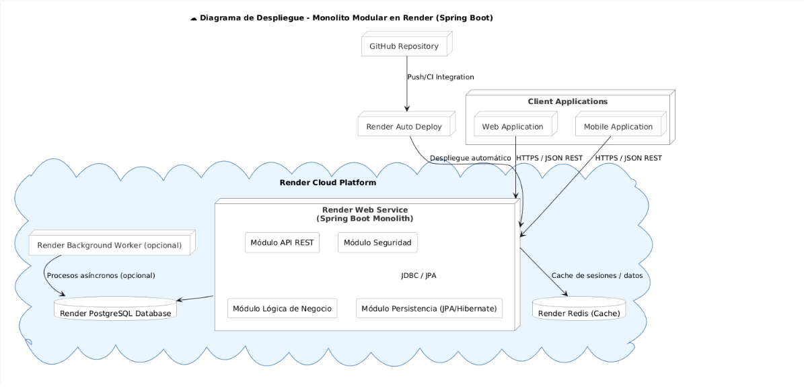

# Documentación Técnica - Vive Medellín

## 1. Diagrama de Despliegue



## 2. APIs Básicas del Sistema (Sprint 1 y 2)

### Sprint 1: Gestión de Usuarios y Autenticación

#### 2.1 API de Autenticación

\`\`\`openapi
openapi: 3.0.0
info:
title: Authentication API
version: 1.0.0
paths:
/api/auth/signup:
post:
summary: Registro de usuario
requestBody:
content:
application/json:
schema:
type: object
properties:
name:
type: string
username:
type: string
email:
type: string
password:
type: string
responses:
'200':
description: Usuario registrado exitosamente

/api/auth/login:
post:
summary: Inicio de sesión
requestBody:
content:
application/json:
schema:
type: object
properties:
username:
type: string
password:
type: string
responses:
'200':
description: Login exitoso
content:
application/json:
schema:
type: object
properties:
accessToken:
type: string
refreshToken:
type: string
\`\`\`

### Sprint 2: Gestión de Eventos

#### 2.2 API de Eventos

\`\`\`openapi
openapi: 3.0.0
info:
title: Events API
version: 1.0.0
paths:
/api/events:
get:
summary: Listar eventos
parameters: - name: page
in: query
schema:
type: integer - name: size
in: query
schema:
type: integer
responses:
'200':
description: Lista de eventos paginada

    post:
      summary: Crear evento
      requestBody:
        content:
          application/json:
            schema:
              $ref: '#/components/schemas/EventDto'
      responses:
        '201':
          description: Evento creado

/api/events/{id}:
get:
summary: Obtener evento por ID
parameters: - name: id
in: path
required: true
schema:
type: integer
responses:
'200':
description: Detalles del evento
\`\`\`

## 3. Microservicios Implementados

### 3.1 Servicio de Autenticación

\`\`\`java
@RestController
@RequestMapping("/api/auth")
public class AuthController {
@PostMapping("/signup")
public ResponseEntity<?> signup(@RequestBody SignupRequest request) {
// Implementación
}

    @PostMapping("/login")
    public ResponseEntity<AuthResponse> login(@RequestBody LoginRequest request) {
        // Implementación
    }

}
\`\`\`

### 3.2 Servicio de Eventos

\`\`\`java
@RestController
@RequestMapping("/api/events")
public class EventController {
@GetMapping
public ResponseEntity<Page<EventSummaryDto>> getEvents(
@RequestParam(defaultValue = "0") int page,
@RequestParam(defaultValue = "10") int size) {
// Implementación
}

    @PostMapping("/save")
    public ResponseEntity<EventDto> createEvent(@RequestBody EventDto eventDto) {
        // Implementación
    }

}
\`\`\`

### 3.3 Servicio de Comentarios

\`\`\`java
@RestController
@RequestMapping("/api/comments")
public class CommentController {
@GetMapping("/event/{eventId}")
public ResponseEntity<List<CommentDto>> getEventComments(@PathVariable Long eventId) {
// Implementación
}

    @PostMapping
    public ResponseEntity<CommentDto> createComment(@RequestBody CommentDto commentDto) {
        // Implementación
    }

}
\`\`\`

## 4. CI/CD con GitHub Actions

### 4.1 Pipeline de CI/CD

\`\`\`yaml
name: CI/CD Pipeline

on:
push:
branches: [ main ]
pull_request:
branches: [ main ]

jobs:
build:
runs-on: ubuntu-latest

    steps:
    - uses: actions/checkout@v3

    - name: Set up JDK 17
      uses: actions/setup-java@v3
      with:
        java-version: '17'
        distribution: 'temurin'

    - name: Build with Maven
      run: mvn -B package --file api/pom.xml

    - name: Run Tests
      run: mvn test --file api/pom.xml

    - name: Build Docker image
      run: |
        docker build -t vivemedellin-api ./api

    - name: Push to Amazon ECR
      if: github.ref == 'refs/heads/main'
      run: |
        aws ecr get-login-password --region us-east-1 | docker login --username AWS --password-stdin ${{ secrets.AWS_ECR_REGISTRY }}
        docker tag vivemedellin-api:latest ${{ secrets.AWS_ECR_REGISTRY }}/vivemedellin-api:latest
        docker push ${{ secrets.AWS_ECR_REGISTRY }}/vivemedellin-api:latest

\`\`\`

## 5. Vulnerabilidades de API Identificadas

### 5.1 Vulnerabilidades y Mitigaciones

| Vulnerabilidad     | Impacto | Mitigación Implementada                    |
| ------------------ | ------- | ------------------------------------------ |
| Inyección SQL      | Alto    | Uso de JPA con consultas parametrizadas    |
| XSS                | Medio   | Sanitización de entrada y escape de salida |
| CSRF               | Alto    | Tokens CSRF en formularios                 |
| Fuerza Bruta       | Alto    | Rate limiting y bloqueo temporal           |
| JWT Sin Expiración | Medio   | Tokens con tiempo de vida limitado         |

### 5.2 Headers de Seguridad Implementados

\`\`\`java
@Configuration
public class SecurityHeadersConfig implements WebMvcConfigurer {
@Override
public void addInterceptors(InterceptorRegistry registry) {
registry.addInterceptor(new HandlerInterceptor() {
@Override
public boolean preHandle(HttpServletRequest request,
HttpServletResponse response,
Object handler) {
response.setHeader("X-Content-Type-Options", "nosniff");
response.setHeader("X-Frame-Options", "DENY");
response.setHeader("X-XSS-Protection", "1; mode=block");
response.setHeader("Strict-Transport-Security",
"max-age=31536000; includeSubDomains");
return true;
}
});
}
}
\`\`\`

## 6. Documentación de APIs

### 6.1 Swagger/OpenAPI

https://vivemedellin-wcse.onrender.com/swagger-ui/index.html

La documentación de las APIs está disponible en:

- Swagger UI: https://vivemedellin-wcse.onrender.com/swagger-ui/index.html
- OpenAPI JSON: https://vivemedellin-wcse.onrender.com/v3/api-docs

### 6.2 Postman Collection

[Descargar Colección Postman](./postman/ViveMedellin.postman_collection.json)

### 6.3 Ejemplos de Uso

#### Registro de Usuario

\`\`\`bash
curl -X POST https://vivemedellin-wcse.onrender.com/api/auth/signup \
 -H 'Content-Type: application/json' \
 -d '{
"name": "Usuario Demo",
"username": "demo",
"email": "demo@example.com",
"password": "Password123!"
}'
\`\`\`

#### Creación de Evento

\`\`\`bash
curl -X POST https://vivemedellin-wcse.onrender.com/api/events/save \
 -H 'Content-Type: application/json' \
 -H 'Authorization: Bearer YOUR_JWT_TOKEN' \
 -d '{
"title": "Evento Demo",
"description": "Descripción del evento",
"startsAt": "2025-12-01T18:00:00",
"endsAt": "2025-12-01T21:00:00",
"locationText": "Parque Arví, Medellín"
}'
\`\`\`

### 6.4 Códigos de Error

| Código | Descripción           | Solución                           |
| ------ | --------------------- | ---------------------------------- |
| 400    | Bad Request           | Revisar el formato de la solicitud |
| 401    | Unauthorized          | Token inválido o expirado          |
| 403    | Forbidden             | No tiene permisos suficientes      |
| 404    | Not Found             | El recurso no existe               |
| 429    | Too Many Requests     | Esperar y reintentar               |
| 500    | Internal Server Error | Contactar soporte                  |

### 6.5 Rate Limiting

```java
@Configuration
public class RateLimitingConfig {
    @Bean
    public KeyResolver userKeyResolver() {
        return exchange -> Mono.just(
            exchange.getRequest()
                   .getHeaders()
                   .getFirst("Authorization"));
    }
}
```

Límites implementados:

- API pública: 100 requests/minuto
- API autenticada: 1000 requests/minuto
- Endpoints sensibles: 10 requests/minuto

### 6.6 Monitoreo y Métricas

Endpoints de monitoreo disponibles:

- Health Check: `/actuator/health`
- Métricas: `/actuator/metrics`
- Info: `/actuator/info`

### 6.7 Ambiente de Pruebas

URL Base:

- Producción: `https://vivemedellin-wcse.onrender.com`
